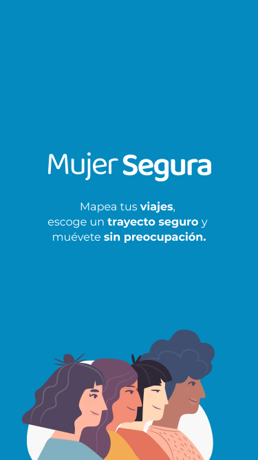
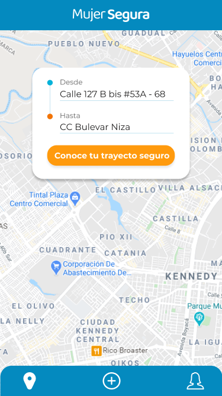
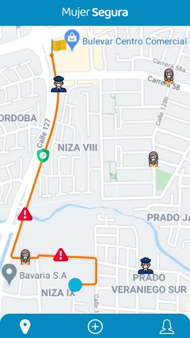
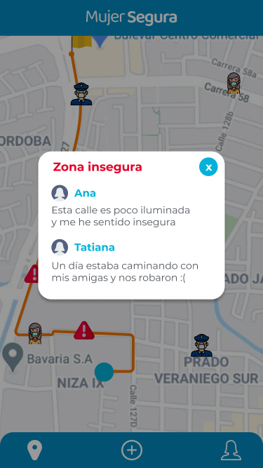
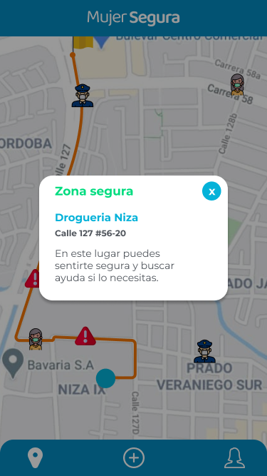
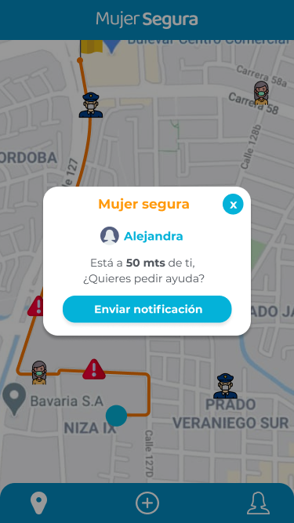
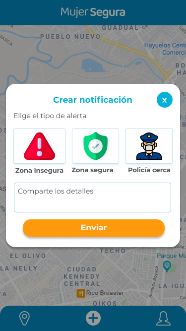
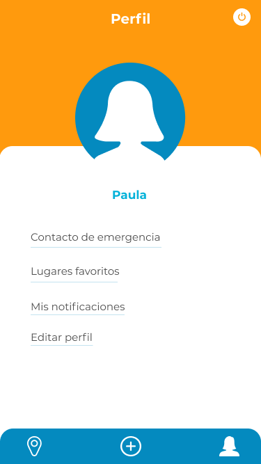
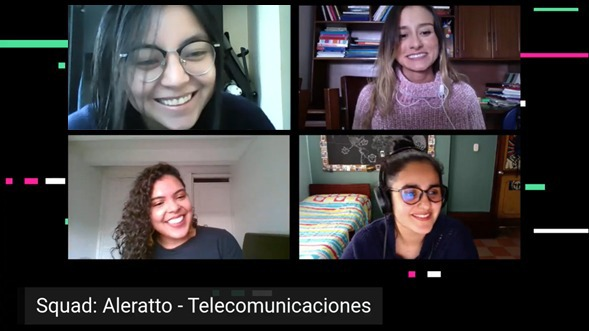

  

# Mujer Segura

## Índice

* [1. Objetivo del proyecto](#1-definición-del-producto)
* [2. Definición del producto](#2-definición-del-producto)
* [3. Investigación UX](#3-investigación-ux)
* [4. Historia de usuarios](#4-historia-de-usuarios)
* [5. Prototipos](#5-prototipos)
* [6. Contribuyentes](#6-contribuyentes)
* [7. Bibliografía](#7-bibliografía)

***

## 1. Objetivo del proyecto

Crear una propuesta para disminuir la brecha de género que existe en distintos espacios sociales como en la industria de telecomunicaciones. Iniciativa de [Laboratoria](https://www.laboratoria.la/) en [Hackeando la desigualdad 2020](https://talento.laboratoria.la/HLDVIRTUAL2020)

## 2. Definición del producto

App que genera recorridos seguros para las mujeres con puntos de consulta por cada paso que dan. En Mujer Segura podrás mapear tu trayecto y encontrar diferentes alertas de zonas inseguras, seguras, policia y otras mujeres que usan la app cerca mientrás te desplazas a mi pie por la ciudad. Nuestra aplicación se encuentra en la etapa de desarrollo.

## 3. Investigación UX

Nuestra investigación estuvo orientada en la movilización con enfoque de género, ya que en ciudades como Lima, Bogotá, Ciudad de México y otras de Latinoamérica las mujeres representan más del 70% de los viajes a pie (Palacios, 2018, p. 60). Actualmente, las mujeres siguen asumiendo la mayoría de responsabilidades del cuidado de la casa, además de su trabajo formal. Por ello, realizan múltiples viajes al día y estos desplazamientos se caracterizan por cubrir menores distancias, que generalmente las realizan a pie. Siendo vulnerables a sufrir algún tipo de acoso sexual, hurto y violencia (Levy, 2013, 2016).

## 4. Historia de usuarios

-	H1: Yo como usuaria quiero poder registrarme en la app para poder conocer cuáles zonas de mi ciudad son inseguras cuando me movilizo.
-	H2: Yo como usuaria quiero poder registrar por georreferenciar en que zona insegura, segura o un policía cerca para que otras mujeres y las autoridades conozcan sobre estos puntos de la ciudad.
-	H3: Yo como usuaria quiero poder contactar a una mujer que este utilizando la aplicación cuando me siento insegura para enviar una alerta de ayuda.

## 5. Prototipos
  
### Prototipo de alta 

#### Paleta de colores:

  

Los colores de nuestro proyecto representan la tranquilidad y el control de la situación, así como con la paz, el entendimiento y la protección. También se vinculan al cuidado de los demás y a la confianza y credibilidad. 

#### Para mobile:

[Demo Figma](https://www.figma.com/proto/G2KuAo1tOJUjBC8lx3v7iL/Hackaton?node-id=30%3A0&viewport=622%2C502%2C0.1365688592195511&scaling=scale-down)

         

## 6. Contribuyentes

  

  

[Alejandra Ibáñez](https://github.com/Malejandraib)
[Paula Lenis B](https://github.com/paulalenisb)
[Ana Rátiva](https://github.com/AnaRativa09)
[Tatiana Toro](https://github.com/tatianatorog)

## 7. Bibliografía
- Palacios, A. (2018). La caminata como modo de transporte para las mujeres en 11 ciudades de América Latina. Transporte y Desarrollo En América Latina, 1(2), 47–64. Retrieved from [scioteca.caf.com](https://scioteca.caf.com/)
- Levy, C. (2013). Travel choice reframed: “deep distribution” and gender in urban transport. Environment and Urbanization, 25(1), 47–63. https://doi.org/10.1177/0956247813477810
- Levy, C. (2016). Routes to the just city: towards gender equality in transport planning. In C. O. N. Moser (Ed.), Gender, Asset Accumulation and Just Cities (pp. 135–149). London, United Kingdom: Routledge.</>
